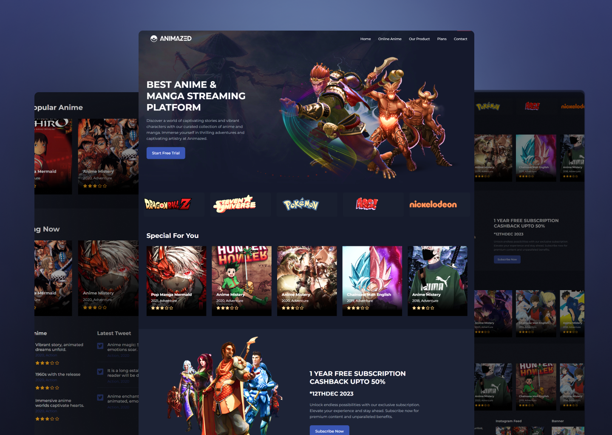

# Modern Anime Website

Welcome to the Modern Anime Website repository! This project is a responsive website dedicated to anime content, crafted using HTML, CSS, and JavaScript. It includes a stylish image slider and features a modern UI design for an immersive user experience.

## Preview



## Features

- **Responsive Design:** Ensures optimal viewing across various devices.
- **Anime Slider:** An interactive slider to showcase featured anime content.
- **Modern UI Design:** Sleek and visually appealing layout for an engaging user interface.

## Getting Started

To explore this Anime Website locally, follow these steps:

1. Clone the repository to your local machine:

   ```bash
   git clone https://github.com/Devsethi3/Modern-Anime-Website.git
   ```

2. Open the `index.html` file in your preferred web browser.

## Contributing

If you'd like to contribute to this project, follow these steps:

1. Fork the repository.
2. Create a new branch for your feature or improvement.
3. Make your changes and commit them with descriptive messages.
4. Push your changes to your forked repository.
5. Open a pull request to merge your changes into the main branch.

Explore the Modern Anime Website, provide feedback, and consider contributing to its development. Thank you for checking out the repository!